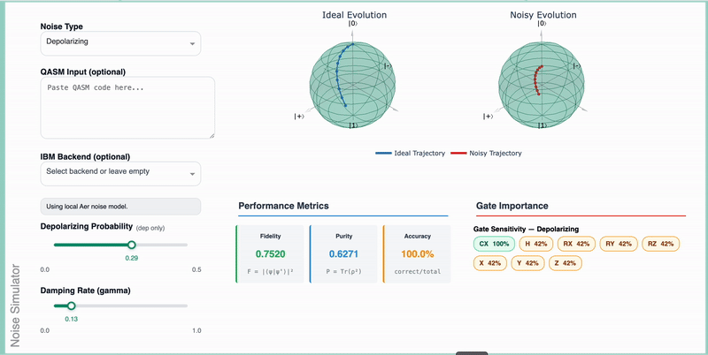

[](https://doi.ieeecomputersociety.org/10.1109/MCG.2024.3456288)
[](https://arxiv.org/abs/2507.17931)

# Quantum Machine Learning Playground

The **Quantum Machine Learning (QML) Playground** is an interactive web application designed to visualize and explore the inner workings of quantum machine learning models in an intuitive and educational way. Inspired by classical tools like TensorFlow Playground, it focuses on parameterized quantum circuits (PQCs) — particularly the *data re-uploading universal quantum classifier* — and introduces visual metaphors such as Bloch spheres and the **Q-simplex** to interpret quantum state evolution.

Now extended beyond classification, the playground also supports **regression tasks**, **uncertainty quantification**, and **regularization techniques**, enabling deeper exploration of quantum model performance and generalization.

Beyond basic model training, the playground now provides noise-aware analysis, robustness diagnostics, and gate-level sensitivity insights, enabling users to explore not only how quantum models learn, but also how they fail under realistic noise.

This playground is ideal for learners, educators, and researchers who want to explore QML models without requiring deep expertise in quantum hardware or simulators.

---

## 🌐 Live Demo

<p align="center">
  
</p>

---

## 🧠 How the Quantum Model Works

The playground demonstrates the **data re-uploading variational quantum model**, a flexible architecture introduced by Pérez-Salinas et al. ([Quantum, 2020](https://quantum-journal.org/papers/q-2020-02-06-226/)). This architecture repeatedly embeds classical features into quantum states using trainable gates, mimicking the depth and expressivity of classical neural networks.

Originally designed for classification, it now also supports **quantum regression**, expanding its educational and research potential.

This model was chosen because it is:

* Structurally similar to common **variational quantum circuit (VQC)** architectures
* **Simple enough to visualize** intuitively
* **Powerful enough to be universal**, capable of approximating any function in principle
* Flexible enough to illustrate **training dynamics**, **regularization effects**, and **uncertainty estimates** for regression tasks

---

## ✨ Features

### 🧩 Core Functionality

* 🧠 **Real-time QML model training and visualization**
* 🌐 **Visual Metaphors for Data and Quantum State Evolution**
  * Bloch Sphere for single-qubit state dynamics
  * Q-Simplex for multi-qubit and entanglement visualization
* 🔍 **Layer-by-Layer Quantum Circuit Analysis**
* 📊 **Interactive Performance Metrics and Learning Curves**
* 🎯 **Decision Boundary Visualizations (for classification)**
* 🧪 **Flexible Dataset Generation and Hyperparameter Controls**
* 🔢 **Regression Task Support** – Go beyond classification to predict continuous target values using quantum circuits
* ⚖️ **Regularization Options** – Add L1/L2 penalties to study overfitting and model smoothness
* 🌫️ **Uncertainty Quantification (for Regression)** – Visualize predictive uncertainty through sampling-based variance estimation, highlighting how model confidence varies across the input space

### 🧪 Noise, Robustness & Sensitivity Analysis (New)

The playground now includes **explicit noise modeling and robustness analysis**, enabling realistic evaluation of QML models.

#### 🔊 Noise Modeling
- Depolarizing noise
- Amplitude damping
- Synthetic backend-inspired noise
- Optional IBM backend calibration data

#### 🧠 Noisy Simulation
- Density-matrix simulation
- Ideal vs noisy execution comparison
- Fidelity and purity tracking

#### 🎯 Gate Sensitivity Analysis
- Gate importance scoring based on fidelity degradation
- Per-gate contribution to overall performance loss
- Identification of noise-critical gates and layers

#### 📉 Noise Metrics
- State fidelity
- Purity
- Entropy
- Bloch-vector degradation


### 🐳 Deployment & Accessibility

* 💻 **Browser-Based Interface** – Explore directly in your browser, no installation needed
* 🐳 **Docker Support for Easy Deployment**
* 📦 **Lightweight and Educational by Design**

---

## 🔧 Requirements

* Python 3.11+
* Virtual environment (virtualenv)
* Required Python packages listed in `requirements.txt`
* Docker and Docker Compose (optional)

---

## 🚀 Installation

```bash
# 1. Clone this repository
git clone https://github.com/fraunhofer-aisec/qml-playground
cd qml-playground

# 2. Set up virtual environment
python -m venv venv
source venv/bin/activate  # On Windows: venv\Scripts\activate

# 3. Install dependencies
pip install -r requirements.txt
```

---

## 🖥️ Running the Application

### Local Development

```bash
python app_dev.py
```

Then visit: [http://127.0.0.1:8050/](http://127.0.0.1:8050/)

### Docker Deployment

Pull the latest Docker image from the GitHub Container Registry:

```bash
docker pull ghcr.io/fraunhofer-aisec/qml-playground:latest
```

```bash
docker-compose up -d  # Start container
docker-compose down   # Stop container
```

---

## 🛠 Troubleshooting

* Ensure all required packages are installed
* Verify port 8050 (local) or 80 (Docker) is free
* Make sure Docker Desktop is running (for Docker users)

---

## 📚 Citation

If you use this tool in your research or presentations, please cite:

> P. Debus, S. Issel, and K. Tscharke, "Quantum Machine Learning Playground," *IEEE Computer Graphics and Applications*, vol. 44, no. 05, pp. 40–53, Sept.–Oct. 2024.
> DOI: [10.1109/MCG.2024.3456288](https://doi.ieeecomputersociety.org/10.1109/MCG.2024.3456288)

The arXiv version of this paper is available here: [2507.17931](https://arxiv.org/abs/2507.17931)

---

## 🙋 Maintainer

Developed and maintained by **[Pascal Debus](https://github.com/pdebus)**, [Quantum Security Technologies (QST)](https://www.aisec.fraunhofer.de/en/fields-of-expertise/CST/QST.html), Fraunhofer AISEC.

If you find this work useful, feel free to connect or reach out for collaboration opportunities!
